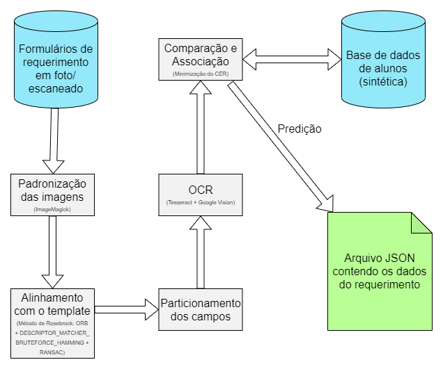

# Pipeline implementado em Python de um extrator automático de informações preenchidas em formulários acadêmicos da UEPB

Este repositório contém os códigos desenvolvidos no meu Trabalho de Conclusão de Curso, para proposta de um modelo extrator automático de informações preenchidas à mão em formulários de requerimento acadêmico da UEPB em formato de imagem (escaneado). 

O código-fonte foi construído em Python, utilizando-se OpenCV e Google Vision, além de outras bibliotecas, e foi inspirado em um projeto anterior de Adrian Rosebrock que pode ser encontrado [aqui](https://www.pyimagesearch.com/2020/08/31/image-alignment-and-registration-with-opencv/).

O fluxograma abaixo esquematiza a arquitetura do pipeline proposto:

